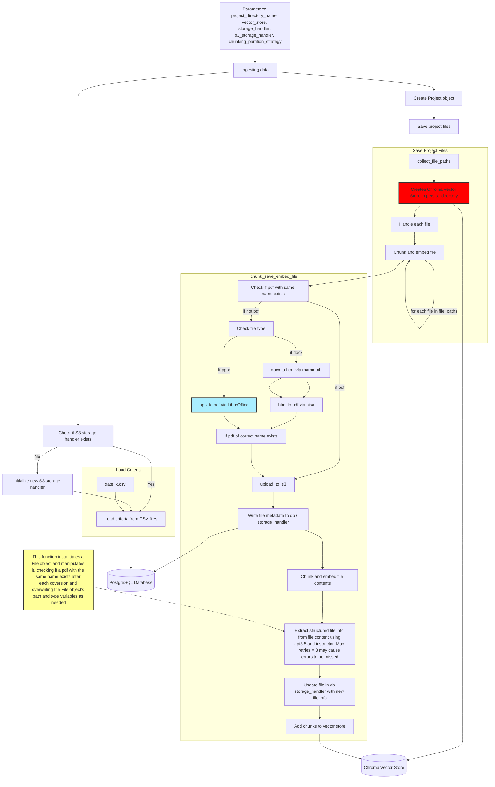

# Ingesting data and analysing projects against criteria

## Overview
This is done in 3 steps:
1. Ingesting the project data
2. Ingesting criteria
3. Evaluating projects against the criteria 

## Ingesting the project data
- Takes input raw .pdf, .doc, .docx, .ppt, .pptx files and loads them into a database and vector store
- Takes input criteria from CSV files and loads them into Postgres
- These criteria are what the project will be assessed against - in the LLM flag evaluation process

### Project file processing
Recursively processes all files in a given project folder. 
- Uploads files to S3 storage
- Converts non-PDF file types (e.g. .doc, .ppt) to PDF 
- Saves file metadata to database (Postgres)
- Chunks text content of files and saves to database
- LLM-generates extra file metadata e.g. readable name and saves to database
- Embeds chunks in vector store for efficient retrieval

*Implemented in `scout/Pipeline/ingest_project_data.py`*

## Criteria loading
- Loads criteria from CSV files into the database - `criterion` table
- Criteria CSVs have columns: `#`,`Category`,`Gate`,`Question`,`Evidence`
- The `Gate` are the different reviews - and should be one of the options in `CriterionGate` (e.g. `GATE_2`)
- Supports multiple gates (e.g., `GATE_2`, `GATE_3`)

*Implemented in `scout/Pipeline/ingest_criteria.py`*

## Evaluate projects (LLM flag)
An LLM is used to evaluate the specified project against a set of pre-defined criteria for a specified review gate.

The evaluation is done using `MainEvaluator.evaluate_questions`. This evaluates against the criteria in the database using the LLM. This is done in the `answer_question` method.

### answer_question method
- Does q and a for each evidence point
- Gets an overall final answer using the answers to the earlier points
- Returns answer and chunks
- Answer is `response.choices[0].message.content` from Open AI
- Chunks is a list of `Chunk` objects read from the vector store

The results of the evaluation are saved to Postgres (`result` table).

*Implemented in `scout/Pipeline/generate_llm_flags.py`*

## Diagram of ingesting project data and criteria

<!-- classDef default fill:#f9f,stroke:#333,stroke-width:2px; -->
