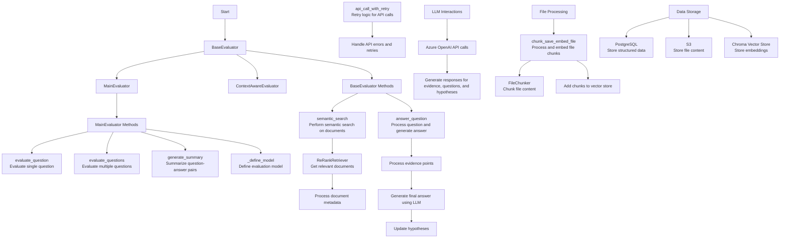

# Overview of `scout.LLMFlag.evaluation.MainEvaluator`

```mermaid

graph TD
    A[Start] --> B[BaseEvaluator]
    B --> C[MainEvaluator]
    B --> D[ContextAwareEvaluator]
    
    B --> E[BaseEvaluator Methods]
    E --> F[semantic_search<br/>Perform semantic search on documents]
    E --> G[answer_question<br/>Process question and generate answer]
    
    C --> H[MainEvaluator Methods]
    H --> I[evaluate_question<br/>Evaluate single question]
    H --> J[evaluate_questions<br/>Evaluate multiple questions]
    H --> K[generate_summary<br/>Summarize question-answer pairs]
    H --> L[_define_model<br/>Define evaluation model]
        
    S[api_call_with_retry<br/>Retry logic for API calls] --> T[Handle API errors and retries]
    
    F --> U[ReRankRetriever<br/>Get relevant documents]
    U --> V[Process document metadata]
    
    G --> W[Process evidence points]
    W --> X[Generate final answer using LLM]
    X --> Y[Update hypotheses]
    
    Z[LLM Interactions] --> AA[Azure OpenAI API calls]
    AA --> AB[Generate responses for evidence, questions, and hypotheses]
    
    AC[File Processing] --> AD[chunk_save_embed_file<br/>Process and embed file chunks]
    AD --> AE[FileChunker<br/>Chunk file content]
    AD --> AF[Add chunks to vector store]
    
    AG[Data Storage] --> AH[PostgreSQL<br/>Store structured data]
    AG --> AI[S3<br/>Store file content]
    AG --> AJ[Chroma Vector Store<br/>Store embeddings]
```

