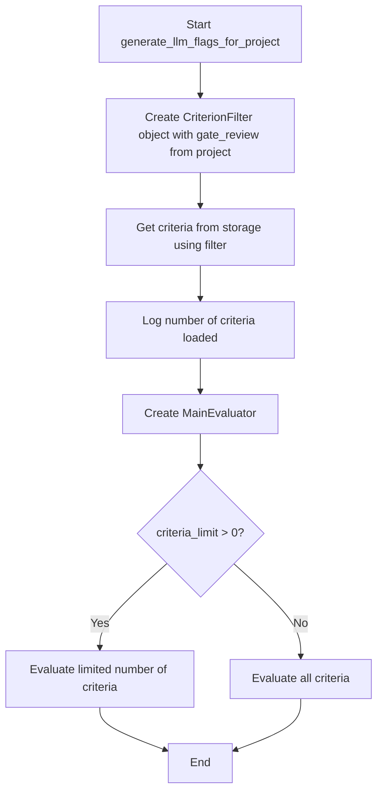
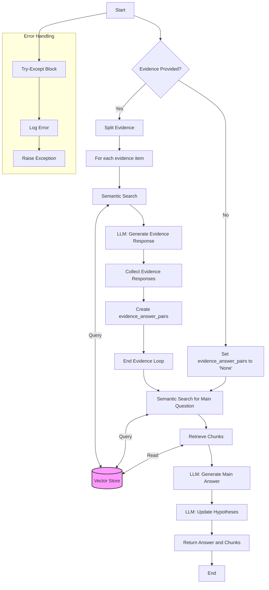

# Overview of `scout.Pipelines.generate_llm_flags_for_project`

```mermaid
graph TD
    A[Start generate_llm_flags_for_project] --> C[Create CriterionFilter object with gate_review from project]
    C --> D[Get criteria from storage using filter]
    D --> E[Log number of criteria loaded]
    E --> F[Create MainEvaluator]
    F --> G{criteria_limit > 0?}
    G -- Yes --> H[Evaluate limited number of criteria]
    G -- No --> I[Evaluate all criteria]
    H --> J[End]
    I --> J
```

```mermaid
flowchart TD
    A[Start] --> B{Evidence Provided?}
    B -->|Yes| C[Split Evidence]
    B -->|No| J[Set evidence_answer_pairs to 'None']
    C --> D[For each evidence item]
    D --> E[Semantic Search]
    E <-->|Query| CHROMA[(Vector Store)]
    E --> F[LLM: Generate Evidence Response]
    F --> G[Collect Evidence Responses]
    G --> H[Create evidence_answer_pairs]
    H --> I[End Evidence Loop]
    I --> K
    J --> K[Semantic Search for Main Question]
    K <-->|Query| CHROMA[(Vector Store)]
    K --> L[Retrieve Chunks]
    L <-->|Read| CHROMA[(Vector Store)]
    L --> M[LLM: Generate Main Answer]
    M --> N[LLM: Update Hypotheses]
    N --> O[Return Answer and Chunks]
    O --> P[End]

    subgraph Error Handling
    Q[Try-Except Block]
    R[Log Error]
    S[Raise Exception]
    end

    A --> Q
    Q --> R
    R --> S

    classDef database fill:#f9f,stroke:#333,stroke-width:2px;
    class CHROMA database;
```