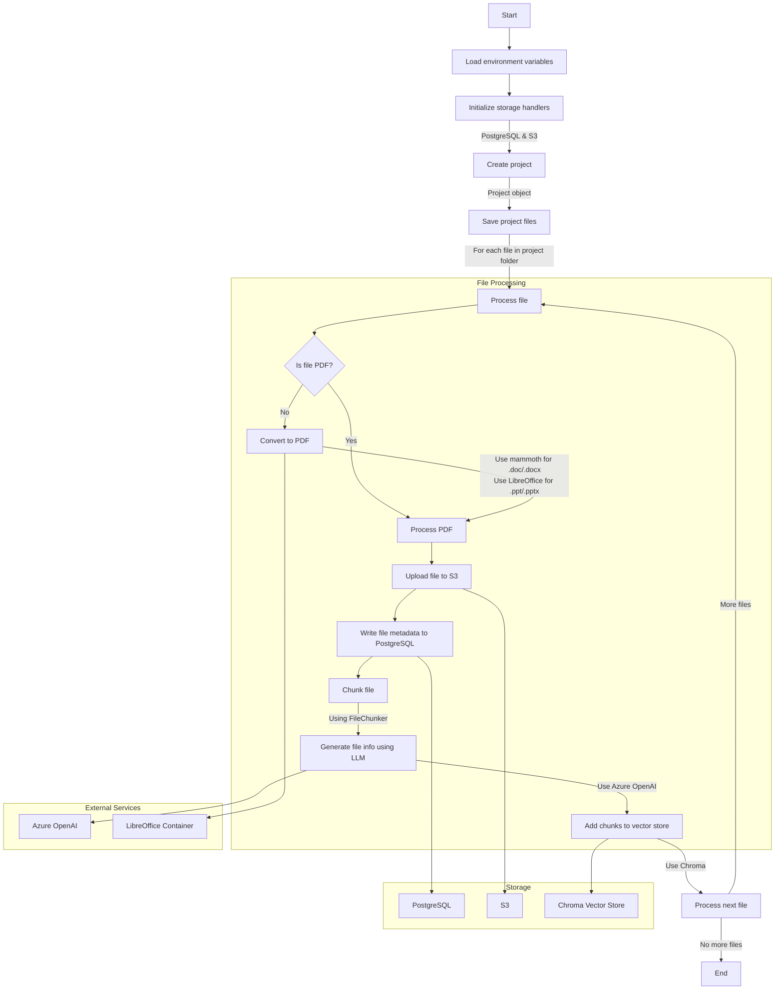

# Overview of project data ingest `scout.ingest_project_data`

Additionally criteria data (CSVs) are ingested from a local file into the database.

```mermaid
graph TD
    A[Start] --> B[Load environment variables]
    B --> C[Initialize storage handlers]
    C --> |PostgreSQL & S3| E[Create project]
    E --> |Project object| F[Save project files]
    F --> |For each file in project folder| G[Process file]
    G --> H{Is file PDF?}
    H -- Yes --> I[Process PDF]
    H -- No --> J[Convert to PDF]
    J --> |Use mammoth for .doc/.docx<br>Use LibreOffice for .ppt/.pptx| I
    I --> K[Upload file to S3]
    K --> L[Write file metadata to PostgreSQL]
    L --> M[Chunk file]
    M --> |Using FileChunker| N[Generate file info using LLM]
    N --> |Use Azure OpenAI| O[Add chunks to vector store]
    O --> |Use Chroma| P[Process next file]
    P -- More files --> G
    P -- No more files --> Q[End]

    subgraph "File Processing"
        G
        H
        I
        J
        K
        L
        M
        N
        O
    end

    subgraph "Storage"
        R[PostgreSQL]
        S[S3]
        T[Chroma Vector Store]
    end

    L --> R
    K --> S
    O --> T

    subgraph "External Services"
        U[Azure OpenAI]
        V[LibreOffice Container]
    end

    N --> U
    J --> V
```
