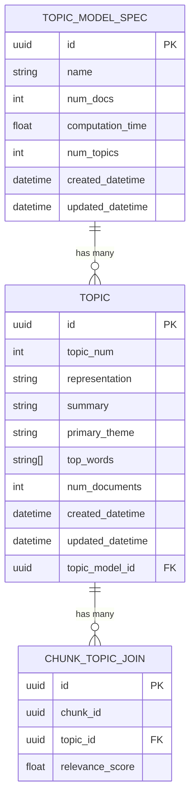

# Topic Modelling for Scout

This is an add on module to Scout that runs a topic modelling pipeline on the data ingested into Scout. This uses a BERTopic approach to cluster chunks together and then uses an LLM to develop representations and summaries of the topics.

This runs locally and need to be installed on top of the rest of Scout.

There is an example script in `scripts` which shows how to run this pipeline.

# Installing the project with IPA Scout

This assumes you have followed the steps to install the main scout package.

Add dependancies to poetry

Topic Modelling outputs are saved to tables in a specific topic_modelling schema inside of the main Scout database.
You will need to run database migrations to add the topic_modelling schema to the Scout database.

```
make install-topics
```

# Running the pipeline

You will need to first run the data ingestion pipeline in the main Scout package. This will perform the chunking and save them into the database in the public schema.

The example script `scripts/find_topics.py` runs the topic modelling pipeline assuming there is already data in the database.

# Database

As in base Scout, the topic data is persisted using PostgreSQL, running in a local docker `db`. All tables related to topic modelling are stored in a separate schema called `topic_modelling`.  

The models are kept in `scout/TopicModelling/storage/postgres_models.py`.

When the pipeline is run, the module saves the chunk_ids into a seperate table which is linked to the modules topic_id, effectively creating a join table between the two.

Topics are stored in the Topics table adn are grouped together by topic model spec, which includes the meta data of a single topic modelling run. 

The schema looks as follows:


